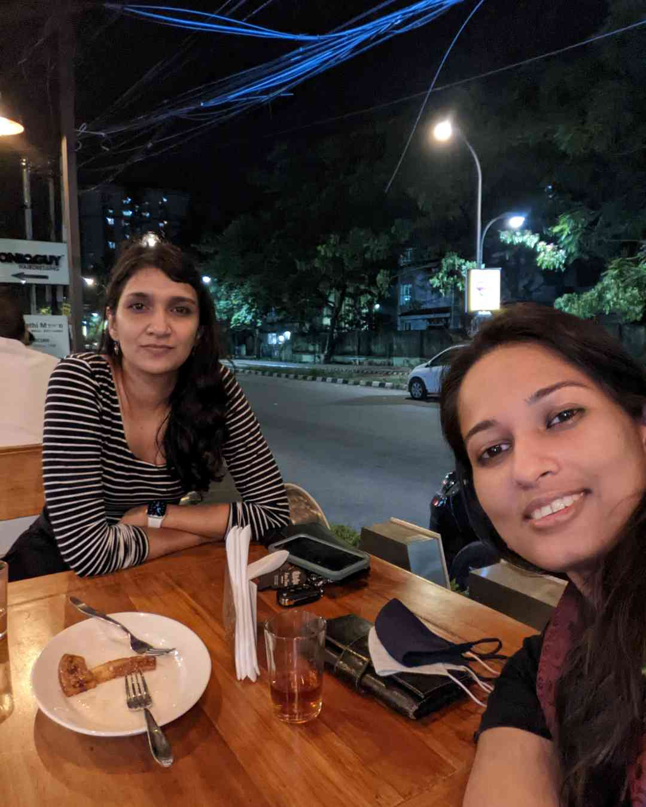

## Our Story

The journey of Magic Cat began during the challenging times of the pandemic when two kindred spirits, Liz and Nanditha, found themselves drawn together by their shared love for cats. Their chance encounter sparked a beautiful friendship and a shared vision - to create a haven for cats in Kerala, a place where abandoned, motherless kittens, injured, paraplegic cats, and all feline friends could find the care, love, and support they deserve.

## Our Mission

At Magic Cat, our mission is simple yet profound: to rescue, rehabilitate, and rehome cats in need. We are committed to providing a lifeline to the most vulnerable felines and ensuring they have a chance at a better life. Our dedicated team of volunteers works tirelessly to give these cats a second chance and to educate the community on proper cat care.

## What We Do

Magic Cat is more than just an aid organization; it's a resource hub for cat lovers and enthusiasts. Our services include:

Rescue and Rehabilitation: We rescue and provide medical care to abandoned, injured, and disabled cats. Our team is trained to handle even the most challenging cases, ensuring that every cat gets the attention they require.

Foster and Adoption: We facilitate fostering and adoption programs to find loving homes for our rescued cats. We believe that every cat deserves a forever family, and we work diligently to make that happen.

Education: We offer guidance and educational resources to cat fosters and pet parents. From nutrition and health care to behavioral advice, we are here to help you provide the best possible care for your feline companion.

Community Engagement: Magic Cat actively engages with the community to raise awareness about responsible pet ownership, the importance of spaying and neutering, and the value of adopting cats from shelters.

## Our Promise

At Magic Cat, every cat's life matters. We promise to be their voice, their protector, and their guide. We believe that by helping cats in need, we can create a more compassionate and caring world for all animals. Together, we can make a difference, one paw at a time.

## Join Us

Whether you're a cat lover, a potential adopter, or simply someone who wants to make a positive impact on the lives of cats in Kerala, we invite you to join us on this magical journey. Together, we can be the change that cats need.

Thank you for visiting Magic Cat - where compassion meets action, and where every cat finds hope and happiness.
